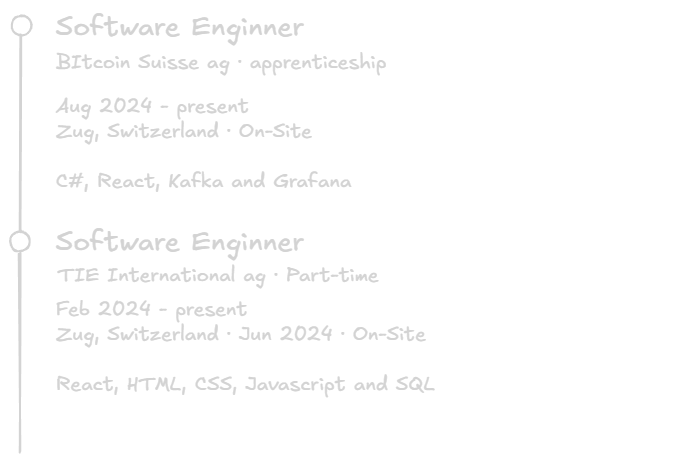

  <strong>Hey there, it's Samuel! 👋</strong> 
  Welcome to my GitHub profile! I'm happy you're here. Here's a little about me:

<h3>About Me</h3>
<ul>
  <li>🎓 <strong>Student:</strong> I'm currently studying computer science at GIBZ.</li>
  <li>💼 <strong>Apprentice:</strong> Working at Bitcoin Suisse.</li>
  <li>🐍 <strong>Python Enthusiast</strong></li>
  <li>🌐 <strong>Crypto Enthusiast:</strong> Passionate about blockchain technology and its potential to transform industries.</li>
  <li>📍 <strong>Location:</strong> Zug</li>
</ul>

## Work Experience

## Work Experience

- **Roelle Boutique** — 2020–Present  
  Marketing Manager & Specialist

- **Fauget Studio** — 2025–2029  
  Marketing Manager & Specialist

- **Studio Showde** — 2024–2025  
  Marketing Manager & Specialist
<h3>Current Projects</h3>
<ul>
  <li>🔗 <strong>Crypto NFT:</strong> Creating an NFT and putting it on the blockchain.</li>
  <li>🔍 Always interested in learning new technologies and meeting people.</li>
  <li>🌱 <strong>Learning:</strong> Smart contract development with Solidity and exploring DeFi platforms.</li>
</ul>

<h3>Hobbies & Interests</h3>
<ul>
  <li>🎹 <strong>Piano:</strong> I always enjoy playing the piano.</li>
  <li>🛹 <strong>Skateboarding:</strong> I skateboard professionally and compete in competitions.</li>
  <li>🥋 <strong>Martial Arts:</strong> In my free time, I love doing Muay Thai, Brazilian Jiu-Jitsu, and Boxing.</li>
  <li>📚 <strong>Reading:</strong> Always learning something new about blockchain and tech innovations.</li>
  <li>🎮 <strong>Gaming:</strong> Enjoy playing strategy and simulation games.</li>
</ul>

<h3>Languages</h3>
<ul>
  <li>💂 English</li>
  <li>🥐 French</li>
  <li>🥨 German B1</li>
  <li>Swiss French</li>
  <li>Swiss German</li>
</ul>

<h3>Skills:</h3>

### Main Skills

### Studying

### Connect with me!

  
  
  
  <a href="https://stackoverflow.com/users/16455043/samuel-glauser" target="_blank">
    

### Employer?

> [!IMPORTANT]  
> <a href="https://github.com/user-attachments/files/25425611/LebenslaufSamuelGlauser.pdf" download>Download my resume</a>

###

